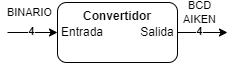
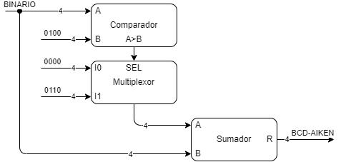

# Biblioteca AED - C8

Conjunto de herramientas, elaboradas en C/C++. Destinadas a las clases practicas de Aplicaciones de Electronica Digital. 

Se pueden usar directamente en PC como en Arduino. Debe tener en cuenta los `#define` adecuados para cada compilador.

## \emoji :speech_balloon: Recomendaciones

1. Confeccionar el diagrama de bloque con los modulos de proposito general (nivel 2)
   1. tomar nota tanto del \emoji :pencil:
      1. sistema a construir (diagrama de nivel 0), 
      2. de lo que deberiamos saber y 
      3. de como cree que se resuelve el problema
   2. indicar el nombre de cada bus
   3. indicar el tamaño de cada bus si es mayor que 1
   4. en lo posible que se vea claramente el flujo de las etapas de...
      1. Izquierda a Derecha
      2. Arriba hacia Abajo
2. Confeccionar el codigo \emoji :computer:
   1. teniendo en cuenta la documentacion \emoji :books:
   2. de arriba hacia abajo segun los niveles de conexion

## Ejemplo: Convertir un **BINARIO** a **BCD-AIKEN**

<u>Nuestro sistema (Diagrama de bloque nivel 0)</u>
* La **ENTRADA** es un numero **BINARIO**
* La **SALIDA** es un numero **BCD-AIKEN**

<center>



**Diagrama de bloque** (nivel 0): Convertir **BINARIO** a **BCD-AIKEN**
</center>

<u>Lo que deberiamos saber</u>
* Un **BCD** es un numero de **4 Bit**
  * por lo tanto el BINARIO tambien debe ser de 4 bit
* De **0 a 4** el **BCD-AIKEN** es **igual** al **BINARIO NATURAL**
  * EJEMPLO. **4:0100** (binario) \f$\Rightarrow\f$ **0100** (AIKEN)
* De **5 a 9** el **BCD-AIKEN** es el **BINARIO** pero **excedido en 6**.
  * EJEMPLO. **5:0101** (binario) \f$\Rightarrow\f$ **1011** (AIKEN) (que es el binario de **11** osea **5+6**)

<u>Una posible solucion</u>
* Si el **BINARIO** que ingresa es...
  * mayor que **4** \f$\Rightarrow\f$ le sumo 6 (**selecciono el 6** para sumar)
  * en caso contrario \f$\Rightarrow\f$ le sumo 0 (**selecciono el 0** para sumar)
* El **resultado** de la **suma** es el **BCD-AIKEN**


<center>




<!-- {html: width=60%} -->


**Diagrama de bloque**: Convertir **BINARIO** a **BCD-AIKEN**


</center>


## \emoji :computer: Confeccion de codigo en **C/C++**

\emoji :floppy_disk: **Binario a BCD-AIKEN**:

```C
#include <common_type_c8.h>
#include <comp_c8.h>
#include <mux_c8.h>
#include <sum_c8.h>

int main() {
// Variable de Entrada
VAR4 binario={.valor=0};
// Definicion e instanciacion Componentes
Comp4bit comparador = Comp4bit();
MuxQ2v1 multiplexor = MuxQ2v1();
Sum4bit sumador = Sum4bit();

printf("BINARIO -> AIKEN ?\n");
printf("D C B A\n");
// LAZO de prueba
for(binario.valor=0;binario.valor<10;binario.valor++){
    // Muestro el valor que ingresa en la entrada
    printf("%d %d %d %d ",binario.b3, binario.b2, binario.b1, binario.b0);
    // CONEXIONES de los BLOQUES
    comparador.conectar(binario.valor,4);
    multiplexor.conectar(6,0,comparador.salida.A_Mayor_B);
    sumador.conectar(multiplexor.salida.bus,binario.valor);
    // Muestro el RESULTADO
    sumador.salidaPorPantalla();
}
    return 0;
}
```

> [!NOTE]  
> Solo se muestra de 0 a 9, por que no nos importa el resto de las
> combinaciones ya que se trata de obtener un BCD...

> [!TIP]
> Hay una version de la documentacion en pdf, pero si tienen acceso
> a internet es preferible la documentacion web.

> [!WARNING]  
> * Prestar atencion a la forma de realizar y el orden de las 
> conexiones de los bloques generales.
> * Respetar siempre el orden de los parametros de conexion.
> * Equivocar el orden de la conexion es un error invisible y muy grave.

---

\emoji :arrow_forward: Resultado por linea de comandos

```
BINARIO -> AIKEN ?
D C B A
0 0 0 0
-> Co R3R2R1R0
    0  0 0 0 0 = 0
0 0 0 1
-> Co R3R2R1R0
    0  0 0 0 1 = 1
0 0 1 0
-> Co R3R2R1R0
    0  0 0 1 0 = 2
0 0 1 1
-> Co R3R2R1R0
    0  0 0 1 1 = 3
0 1 0 0
-> Co R3R2R1R0
    0  0 1 0 0 = 4
0 1 0 1
-> Co R3R2R1R0
    0  1 0 1 1 = 11
0 1 1 0
-> Co R3R2R1R0
    0  1 1 0 0 = 12
0 1 1 1
-> Co R3R2R1R0
    0  1 1 0 1 = 13
1 0 0 0
-> Co R3R2R1R0
    0  1 1 1 0 = 14
1 0 0 1
-> Co R3R2R1R0
    0  1 1 1 1 = 15
```